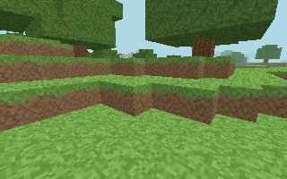

# Sandvoxel

[](https://github.com/Seigh-sword/sandvoxels/actions/workflows/ci.yml)
[](https://github.com/Seigh-sword/sandvoxels/actions/workflows/release.yml)
[](LICENSE)
[](native/tools/ts2c.mjs)
[](src/game/engine.ts)
[](https://sandvoxel.pages.dev)

Sandvoxel is a cozy voxel sandbox with a full pixel-art identity: bitmap type, hand-drawn pixel icons, a low-resolution WebGL canvas scaled up with nearest-neighbour filtering, and procedurally generated worlds you can build in, mine, and save.

One portable TypeScript core drives every edition of the game. The browser renders it with WebGL through Three.js. Native editions compile that same core to C with a bundled TypeScript-to-C compiler and run it on SDL2 with OpenGL, or on a dependency-free software pixel renderer.



The image above is a frame produced by the native C software renderer, not a browser screenshot.

## Playing in the browser

```
npm ci
npm run dev
```

Open the printed URL. For a single self-contained HTML file (fonts, icons, and biome previews inlined) run:

```
npm run build
```

The result is `dist/index.html`, which is also the artifact you would upload to a web game portal.

## Controls

| Action | Desktop | Mobile |
| --- | --- | --- |
| Move | W A S D or arrows | Arrow pad |
| Look | Mouse or drag | Drag anywhere |
| Jump / fly up | Space | Jump button |
| Descend | Q | Down button |
| Mine | Left click or R | Mine button |
| Build | Right click or E | Build button |
| Choose block | 1-9 or scroll | Hotbar tap |
| Fly toggle | F | Fly button |
| Sprint | Shift | - |
| Pause | Esc | Pause button |

## Mobile support

Touch controls are detected automatically through pointer and touch capability, and can be forced from Settings. The layout adapts below 760px, the game canvas uses `touch-action: none` so dragging never scrolls or zooms the page, the viewport is locked against pinch zoom, and safe-area insets are respected for notched devices. Performance mode lowers the internal render resolution, which keeps older phones smooth and saves battery.

## The portable core

`src/core/` holds everything that defines the simulation, with no DOM, no Three.js, and no strings:

- `palette.ts`: block ids, atlas tiles, and the 16x16 texture atlas rasterizer.
- `world.ts`: seeded value-noise terrain, biomes, trees, rivers, and the edit journal.
- `mesh.ts`: greedy-free chunk mesher emitting positions, normals, uvs, and indices.
- `player.ts`: collision, walking, jumping, flying, and voxel raycasting.

The browser engine (`src/game/engine.ts`) uploads the core's meshes and atlas to WebGL. The native build transpiles the same files to C.

## TypeScript to C

`native/tools/ts2c.mjs` is a purpose-built TypeScript-to-C compiler built on the TypeScript compiler API. It walks the AST of the core files and emits readable C99: classes become structs with constructor and method functions, typed arrays become `calloc` buffers, `Math` maps to `math.h`, and bitwise operators get explicit `int32_t` casts so the integer hash is bit-identical in JavaScript and C.

```
npm run native:core
```

writes `native/generated/sandvoxel_core.c` and `native/generated/sandvoxel_core.h`. Generated code is not committed; it is produced by CI and by the command above.

Because two compilers now share one source of truth, the repository ships a differential test: `native/src/core_check.c` and `native/tools/core-check.mjs` run the same scenario (terrain checksum, atlas checksum, chunk meshes, raycast, 240 physics ticks, edits) through C and through Node and diff the output.

```
npm run native:test
```

## Native builds

The SDL2 edition is a playable game: window, keyboard and mouse, chunked OpenGL rendering with the nearest-filtered atlas, water plane, and a binary save file. The headless edition needs only a C compiler and libc; it simulates the world and writes a PPM frame with the software raycasting renderer in `native/src/render_soft.c`.

```
make -C native sdl    # needs SDL2 and OpenGL
make -C native soft   # libc only
./native/build/sandvoxel-headless 82413 0 1 60 320 200 frame.ppm
```

Arguments are: seed, biome (0 forest, 1 desert, 2 alpine), mode (0 explorer, 1 creative), ticks, width, height, output path, optional save file.

Cross-compiling is just a different `CC`:

```
make -C native soft CC=aarch64-linux-gnu-gcc
make -C native soft CC=riscv64-linux-gnu-gcc
make -C native soft CC=aarch64-w64-mingw32-gcc
```

## Release matrix

`.github/workflows/release.yml` builds every supported target and attaches them to a tagged release:

| Target | Edition | Toolchain |
| --- | --- | --- |
| Linux amd64 | SDL2 + OpenGL | gcc, libsdl2-dev |
| Linux arm64 | software renderer | aarch64-linux-gnu-gcc |
| Linux riscv64 | software renderer | riscv64-linux-gnu-gcc |
| Windows amd64 | SDL2 + OpenGL | mingw-w64 with SDL2 mingw libs |
| Windows arm64 | software renderer | aarch64-w64-mingw32-gcc |
| macOS amd64 | SDL2 + OpenGL | clang, Homebrew SDL2 |
| macOS arm64 | SDL2 + OpenGL | clang, Homebrew SDL2 |
| Web | WebGL | vite single-file build |

`.github/workflows/ci.yml` runs the typecheck, the web build, a Playwright smoke test on desktop and mobile viewports, the TypeScript-to-C transpile, the differential core test, and a headless native frame render on every push.

## Hosting on Cloudflare Pages

The repository ships everything Cloudflare Pages needs:

- `wrangler.toml` declares the project name and `dist` as the build output, so `wrangler pages deploy` and the Cloudflare dashboard both pick up the right directory. Build command `npm run build`, Node 22.
- `public/_headers` sets nosniff, referrer, and permissions policies plus per-asset caching. It deliberately omits frame restrictions and a strict CSP: the single-file build inlines its script and style, and portals embed the game in iframes.
- `public/_redirects` rewrites every path to `index.html` so deep links survive.
- `public/manifest.webmanifest`, `icon-192.png`, `icon-512.png`, `apple-touch-icon.png`, and `og.png` cover install metadata and link previews; `tools/make-icons.mjs` regenerates them from the pixel cube and the forest preview.
- `.github/workflows/deploy-cloudflare.yml` deploys on manual dispatch using the `CLOUDFLARE_API_TOKEN` and `CLOUDFLARE_ACCOUNT_ID` secrets: `npx wrangler pages deploy dist --project-name=sandvoxel` is the equivalent local command.

## Saves

Browser worlds live in `localStorage` under `sandvoxel-*` keys and can be exported as JSON from any world menu. Native saves use a small binary format (`SVX1`) next to the executable. Both store the edit journal plus player position, rotation, and flight state, so terrain stays procedural and saves stay tiny.

## Portals and SDKs

`src/platform/platform.ts` is the single seam between the game and any hosting portal. It exposes init, loading progress, gameplay start and stop, and reward hooks. The bundled implementation is a no-op for the open web; a portal SDK can be dropped in later by adding one class and swapping the export, without touching gameplay code.

## License

ISC. See [LICENSE](LICENSE).
